# 

Jarkom-Modul-1-D06-2023

## Anggota Kelompok

| Nama                               | NRP        |
| ---------------------------------- | ---------- |
| Achmad Khosyi’ Assajjad Ramandanta | 5025211007 |
| Daud Dhiya' Rozaan                 | 5025211021 |

## No 1

User melakukan berbagai aktivitas dengan menggunakan protokol FTP. Salah satunya adalah mengunggah suatu file.

- Berapakah sequence number (raw) pada packet yang menunjukkan aktivitas tersebut?
- Berapakah acknowledge number (raw) pada packet yang menunjukkan aktivitas tersebut?
- Berapakah sequence number (raw) pada packet yang menunjukkan response dari aktivitas tersebut?
- Berapakah acknowledge number (raw) pada packet yang menunjukkan response dari aktivitas tersebut?

**Jawab**

Untuk mencari packet yang memiliki fungsi mengunggah file, kita dapat melakukan filter di wireshark dengan command `ftp.request.command == "STOR"`.

Lalu pencet packet tersebut dan buka bagian `Transmission Control Protocol`. Disana akan terlihat berapa sequence number (raw) dan acknowledge number (raw) dari packet tersebut.

`SS Hasil`
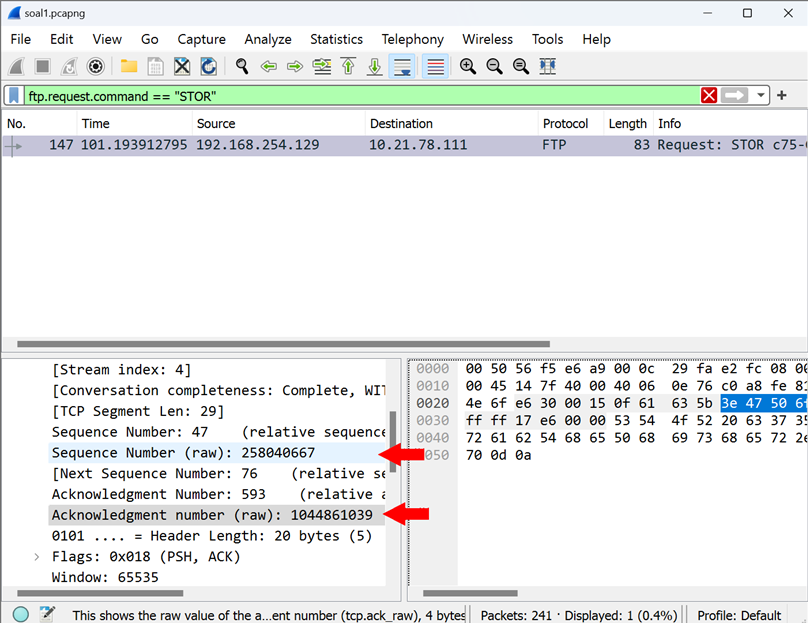

- **Jawaban nomor 1a : 258040667**
- **Jawaban nomor 1b : 1044861039**

Untuk mencari packet yang menerima respon dari packet yang telah mengunggah file tersebut, maka cukup scroll kebawah dan biasanya 2 packet dibawah packet yang mengunggah adalah packet yang menerima respon. Karena nomor packet yang mengunggah adalah 147, maka packet nomor packet yang menerima respon adalah 149.

Sama seperti sebelumnya, tinggal pencet packet tersebut dan buka bagian `Transmission Control Protocol`. Disana akan terlihat berapa sequence number (raw) dan acknowledge number (raw) dari packet tersebut.

`SS Hasil`
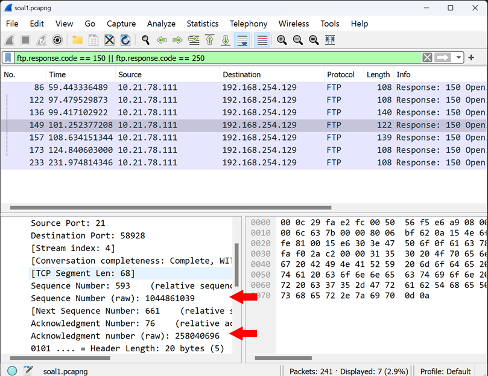

- **Jawaban nomor 1c : 1044861039**
- **Jawaban nomor 1d : 258040696**

`SS Flag`
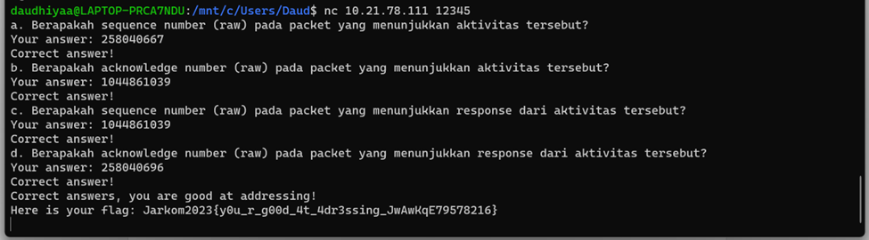

## No 2

Sebutkan web server yang digunakan pada portal praktikum Jaringan Komputer!

**Jawab**

Buka portal praktikum jarkom di chrome, lalu gunakan extension `wappalyzer` dari chrome.

`SS Hasil`
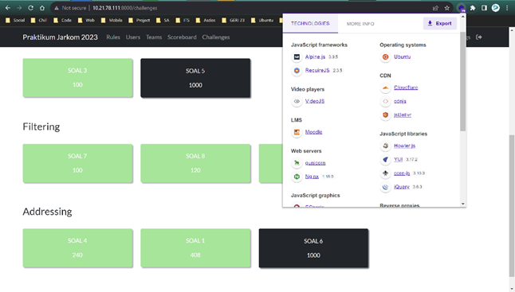

**Jawaban nomor 2 : gunicorn**

`SS Flag`
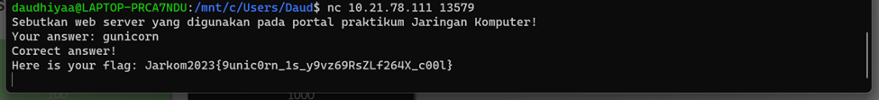

## No 3

Dapin sedang belajar analisis jaringan. Bantulah Dapin untuk mengerjakan soal berikut:

- Berapa banyak paket yang tercapture dengan IP source maupun destination address adalah 239.255.255.250 dengan port 3702?
- Protokol layer transport apa yang digunakan?

**Jawab**

Gunakan filter: `udp.port == 3702 && (ip.dst ==  239.255.255.250 || ip.src ==  239.255.255.250)`, lalu hitung manual. Disitu juga akan nampak protocol apa yang digunakan.

`SS Hasil`
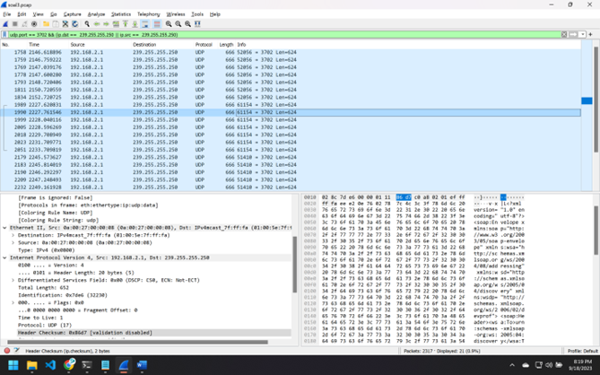

- **Jawaban nomor 3a : 21**
- **Jawaban nomor 3b : UDP**

`SS Flag`
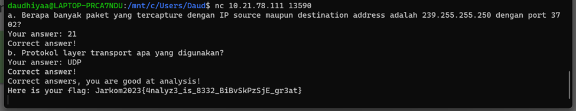

## No 4

Berapa nilai checksum yang didapat dari header pada paket nomor 130?

**Jawab**

klik 2x pada paket no 130, lalu buka bagian `User Diagram Protocol`, lalu lihat bagian `Checksum`

`SS Hasil`
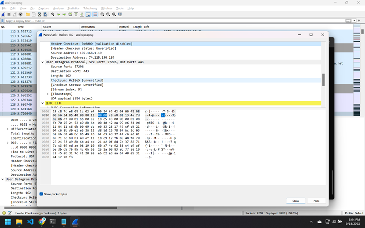

**Jawaban nomor 4 : 0x18e5**

`SS Flag`
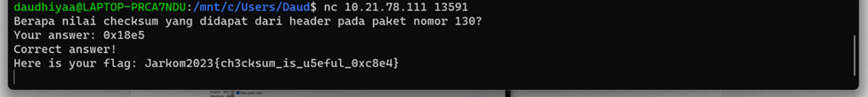

## No 5

Elshe menemukan suatu file packet capture yang menarik. Bantulah Elshe untuk menganalisis file packet capture tersebut.

- Berapa banyak packet yang berhasil di capture dari file pcap tersebut?
- Port berapakah pada server yang digunakan untuk service SMTP?
- Dari semua alamat IP yang tercapture, IP berapakah yang merupakan public IP?

**Jawab**

Pertama-tama, karena pada nomor 5 ini kami dikasih 2 file yaitu file soal5.pcap dan file zippppfileee.zip, dan kami harus mencari password untuk membuka file .zip tersebut terlebih dahulu agar kita mendapatkan `nc` agar bisa menjawab pertanyaan.

Karena pada nomor 5 topiknya adalah `SMTP`, maka kami berusaha untuk mencari packet yang relevan dengan `MAIL`. Ditemukan satu packet dengan isi info `MAIL`, lalu klik kanan pada packet tersebut dan klik `follow TCP Stream`.

`SS Hasil`
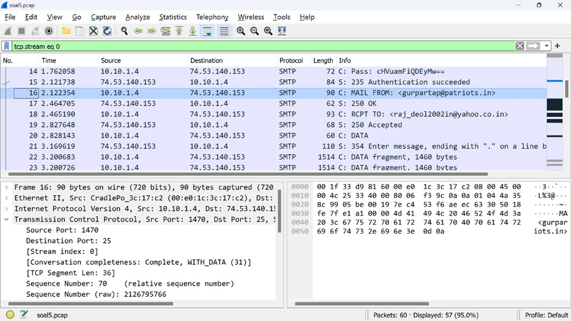

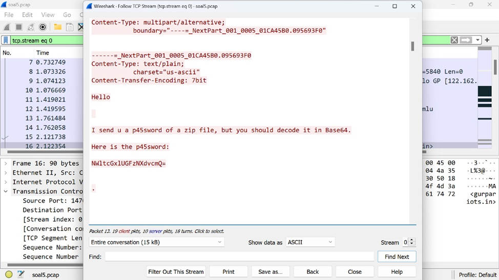

Di dalam file tersebut, ditemukan password untuk membuka file .zip-nya yaitu `NWltcGxlUGFzNXdvcmQ=` namun harus di decode menggunakan `Base64` terlebih dahulu. Lalu, kami melakukan decode di web `base64decode.org` dan menemukan password asli dari file .zip-nya yaitu `5implePas5word`.

`SS Hasil`
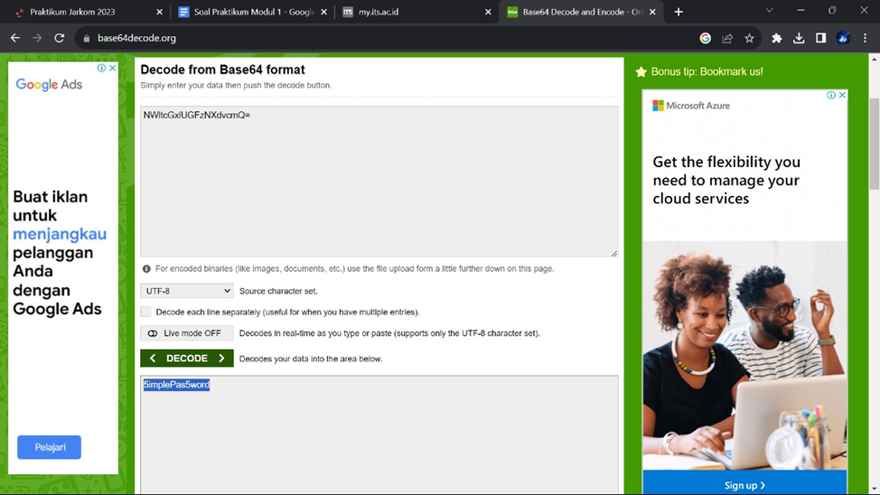

Lalu, tinggal extract file .zip tersebut dan kami mendapatkan file .txt yang isinya terdapat `nc` untuk menjawab pertanyaan.

`SS Hasil`

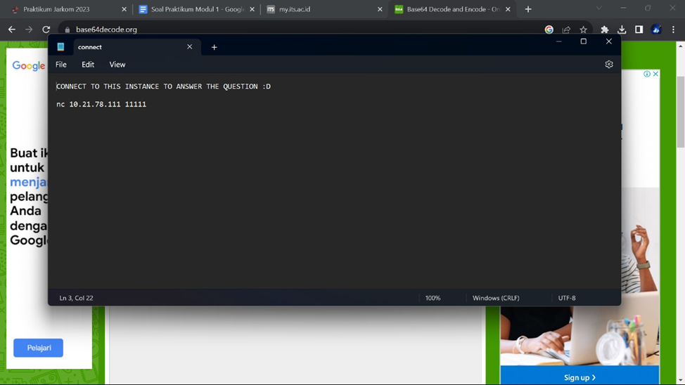

Untuk menjawab nomor 5a, tinggal buka file `soal5.pcap`, lalu scroll kebawah dan lihat nomor packet terakhir.

**Jawaban nomor 5a : 60**

Untuk menjawab nomor 5b, tinggal menggunakan filter `smtp`, lalu klik pada salah satu packet agar dapat mengetahui port dari `smtp`.

`SS Hasil`
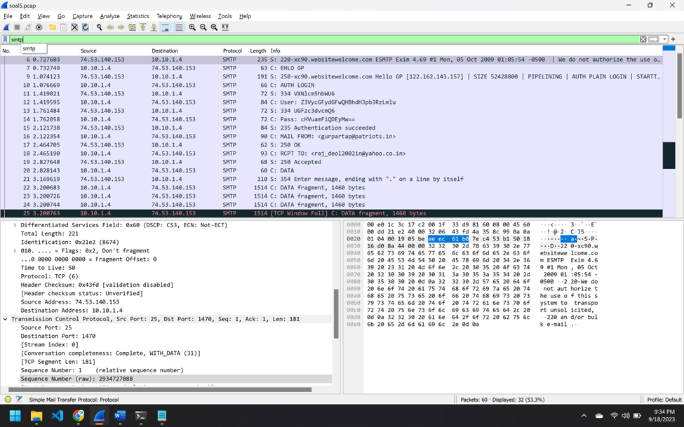

**Jawaban nomor 5b : 25**

Untuk menjawab nomor 6c, kami mencari ip yang infonya berhubungan dengan komunikasi secara global, salah satunya adalah komunikasi email. Dan ditemukan antara `10.10.1.4` atau `74.53.140.154`. Karena kami menganggap bahwa ip dengan awalan `10` adalah ip dari ITS, maka kami menjawab ip dengan awalan `74`.

**Jawaban nomor 5c : 74.53.140.154**

`Foto SS Flag`
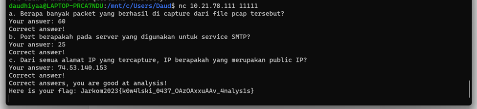

## No 6

Seorang anak bernama Udin Berteman dengan SlameT yang merupakan seorang penggemar film detektif. sebagai teman yang baik, Ia selalu mengajak slamet untuk bermain valoranT bersama. suatu malam, terjadi sebuah hal yang tak terdUga. ketika udin mereka membuka game tersebut, laptop udin menunjukkan sebuah field text dan Sebuah kode Invalid bertuliskan "server SOURCE ADDRESS 7812 is invalid". ketika ditelusuri di google, hasil pencarian hanya menampilkan a1 e5 u21. jiwa detektif slamet pun bergejolak. bantulah udin dan slamet untuk menemukan solusi kode error tersebut.
- Clue 1: Sepertinya ada yang salah dengan penulisan tersebut secara KBBI. Ada sesuatu yang Besar di depan mata.
- Clue 2: Jenis cipher merupakan substitusi a1z26 Cipher
- Clue 3: Rentang Huruf yang digunakan Huruf A-R, 1-18 dengan Jawaban 6 Huruf.
- Clue 4: SOURCE ADDRESS ADALAH KUNCI SEMUANYA.

**Jawab :**

Dari clue yang kita dapat, kita hanya perlu untuk membuka file .pcap nya dan mencari packet dengan nomor 7812 lalu melihat IP nya karena dalam soal disebutkan `SOURCE ADDRESS 7812`. 

`SS HASIL
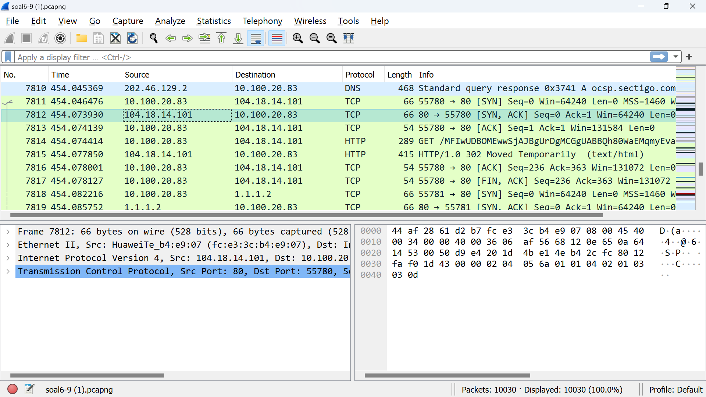

Dari clue berikutnya, kita hanya perlu memasukkan IP packet tersebut ke `a1z26 Chipper` atau kita bisa menghitungnya secara manual, dan didapatkan jawabannya.

`SS FOTO`
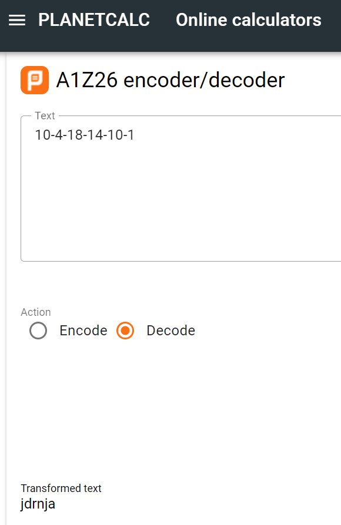

Karena pada clue terakhir, semua hurufnya besar, maka kita memasukkan jawaban dengan huruf besar.

`JAWABAN : JDRNJA`

`SS FOTO`
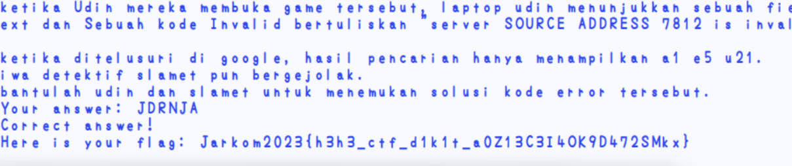

## No 7

Berapa jumlah packet yang menuju IP 184.87.193.88?

**Jawab**

Gunakan filter: `ip.dst == 184.87.193.88` yang artinya memfilter ip yang berdestinasi 184.87.193.88. Lalu hitung banyak paket yg muncul.

`SS Hasil`
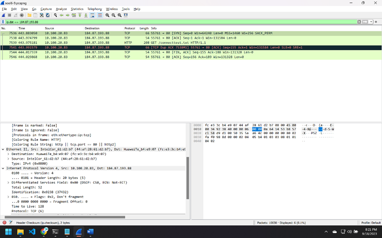

**Jawaban nomor 7 : 6**

`SS Flag`
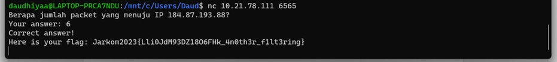

## No 8

Berikan kueri filter sehingga wireshark hanya mengambil semua protokol paket yang menuju port 80! (Jika terdapat lebih dari 1 port, maka urutkan sesuai dengan abjad)

**Jawab**

Untuk kueri filter menuju port tertentu, maka gunakan `tcp.dstport == ... || udp.dstport == ...`.

**Jawaban nomor 8 : tcp.dstport == 80 || udp.dstport == 80**

`SS Flag`
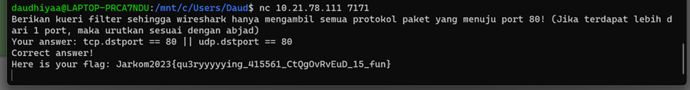

## No 9

Berikan kueri filter sehingga wireshark hanya mengambil paket yang berasal dari alamat 10.51.40.1 tetapi tidak menuju ke alamat 10.39.55.34!

**Jawab**

Translate soal tersebut menjadi persamaan logika di pemrograman.

Untuk memfilter paket yg berasal dari suatu alamat, gunakan `ip.src == ...`. Sedangkan untuk memfilter paket yg tidak menuju ke suatu alamat, gunakan `ip.dst != ...`.

**Jawaban nomor 9 : ip.src == 10.51.40.1 && ip.dst != 10.39.55.34**

`SS Flag`
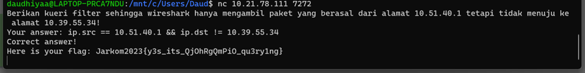

## No 10

Sebutkan kredensial yang benar ketika user mencoba login menggunakan Telnet

**Jawab**

Gunakan filter: `telnet.cmd`, lalu klik kanan salah satu paket untuk follow tcp stream, lalu terdapat kredensial user(dhafin) & password (kesayangannyak0k0)

`SS Hasil`
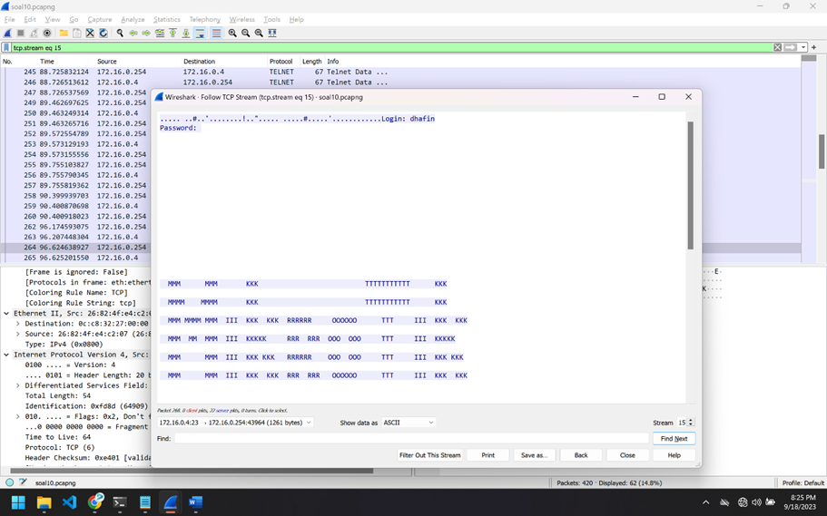

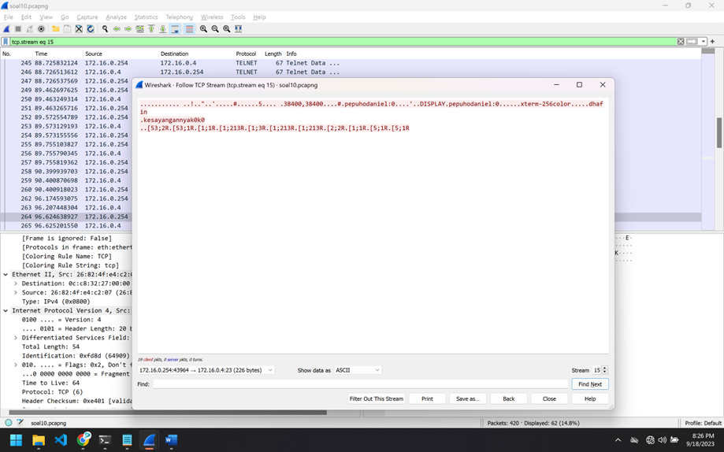

**Jawaban nomor 10 : dhafin:kesayangannyak0k0**

`SS Flag`
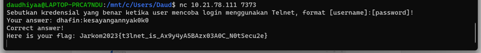
